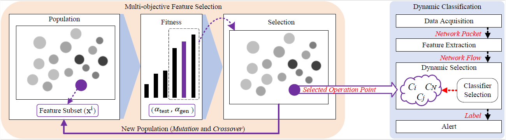

# A Dynamic Network Intrusion Detection Model for Infrastructure as Code Deployed Environments

## Authors: Adilson G. Filho, Eduardo K. Viegas, Altair O. Santin, and Jhonatan Geremias
The dynamic nature of Infrastructure as Code (IaC) provisioned infrastructures presents substantial challenges for traditional Machine Learning (ML) Network Intrusion Detection Systems (NIDSs). In such settings, continuously evolving configurations lead to difficulties in maintaining detection accuracy, as ML models struggle to adapt to rapidly changing network behaviors and new attack patterns. This paper introduces a novel ML-based NIDS framework tailored to address the non-stationary behavior of IaC-provisioned infrastructures. The framework integrates two key components: multi-objective feature selection and dynamic classification. The multi-objective feature selection enhances the model's generalization capabilities during training, enabling it to better handle the evolving behaviors characteristic of IaC environments. The dynamic classification component complements this by actively selecting the most appropriate subset of classifiers at the inference phase, ensuring adaptability to the current infrastructure state. By incorporating these components, the proposed scheme achieves real-time adaptability to the dynamic nature of IaC-provisioned infrastructures, providing reliable intrusion detection. Experimental evaluations conducted on a realistic IaC-generated testbed with over 19 configurations demonstrate significant improvements in detection performance. Specifically, the proposed model can increase the F1-Score by up to 0.31 when compared to traditional approaches on newly provisioned IaC infrastructures.

## Proposal

##

 
